<p align="center">
  
</p>

<p align="center">
  
</p>

<p align="center">
  <a href="https://github.com/Mohammed-Elhawary?tab=repositories"></a>
  
  
  
  <!-- Add your links here -->
  <!-- <a href="https://www.linkedin.com/in/YOUR-USERNAME"></a> -->
  <!-- <a href="mailto:your@email.com"></a> -->
</p>

---

## 🛰️ Mission Briefing

I'm a backend engineer who enjoys designing clean, maintainable services and REST APIs.

```text
 PILOT        Mohamed El-Hawary
 ACADEMY      B.Sc. Information Technology, Borg El Arab Technological University
 GRADUATED    2026 · Excellent (93.24%)
 SPECIALTY    Java · Spring Boot · microservices architecture
 SECURITY     Spring Security · Keycloak (OAuth2 / JWT)
 DATA         MariaDB / MySQL · InfluxDB · Hibernate/JPA · Flyway migrations
 CARGO        Dockerized services, event streaming with Kafka
 NEXT MISSION Junior Java backend role
```

---

## 🪐 Tech Stack

**Backend**


**Databases**


**DevOps, Observability & Testing**


---

## 🚀 Featured Missions

<table>
<tr>
<td width="50%" valign="top">

### 🏦 [Banking System](https://github.com/Mohammed-Elhawary/Banking-System)

Microservices banking platform behind an API gateway with rate limiting. Six services: account, transaction, payment, fraud detection, notification, and the gateway itself.

**Stack:** Java, Spring Boot, MariaDB, Cassandra, Docker Compose

</td>
<td width="50%" valign="top">

### ⚡ [Home Energy Tracker](https://github.com/Mohammed-Elhawary/home-energy-tracker)

Seven Spring Boot services that stream smart-device readings through Kafka into InfluxDB, send threshold alerts by email, and generate AI energy-saving tips with Spring AI.

**Stack:** Java 21, Kafka, InfluxDB, MariaDB, Keycloak, Resilience4j, Prometheus, Grafana

</td>
</tr>
</table>

| Mission | What it does | Tech |
|---------|--------------|------|
| [Banking-System](https://github.com/Mohammed-Elhawary/Banking-System) | Accounts, transactions, payments and fraud detection as separate services | Java, Spring Boot, MariaDB, Docker |
| [home-energy-tracker](https://github.com/Mohammed-Elhawary/home-energy-tracker) | Real-time energy monitoring with alerts, JWT security and AI insights | Java 21, Kafka, InfluxDB, Keycloak |

---

## 📡 Mission Control · GitHub Stats

<p align="center">
  
  
</p>

<p align="center">
  
</p>

<p align="center">
  
</p>

---

## 🐍 Contributions Snake

<picture>
  <source media="(prefers-color-scheme: dark)" srcset="https://raw.githubusercontent.com/Mohammed-Elhawary/Mohammed-Elhawary/output/github-contribution-grid-snake-dark.svg">
  <source media="(prefers-color-scheme: light)" srcset="https://raw.githubusercontent.com/Mohammed-Elhawary/Mohammed-Elhawary/output/github-contribution-grid-snake.svg">
  
</picture>

<p align="center">
  
</p>
